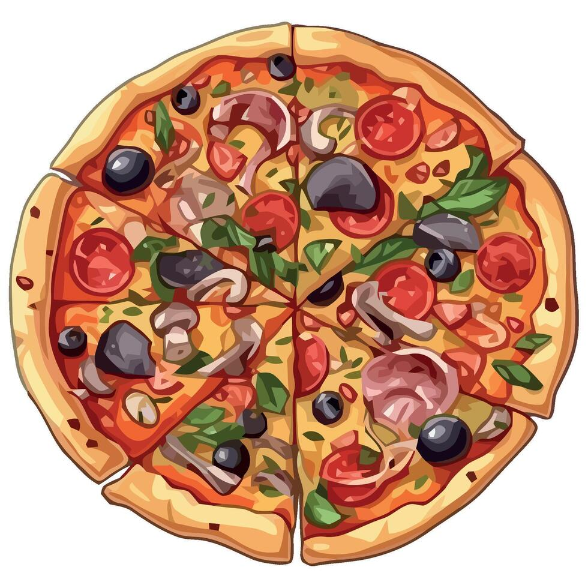
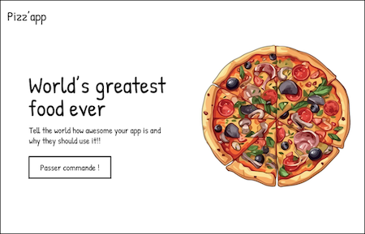
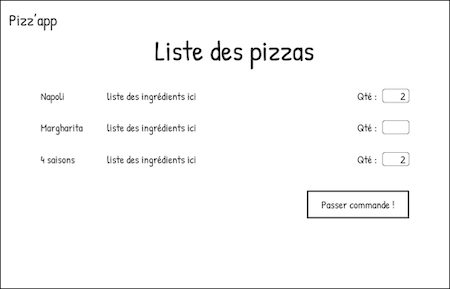
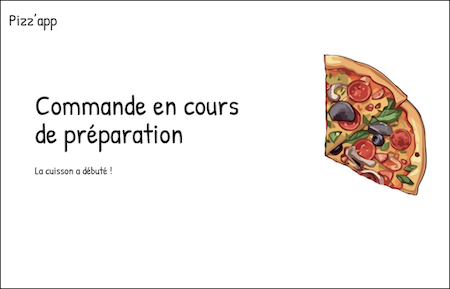
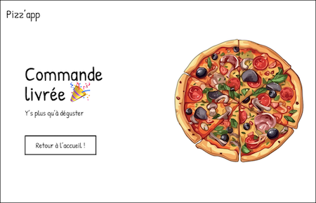

# Let's make pizza !

<p align="center">

</p>

Vous allez devoir développer un système distribué permettant de commander
des pizzas, les préparer, les cuire, et suivre leur livraison.

## Communication

La communication entre les différents protagonistes (i.e. les clients d'un côté et les pizzerias de l'autre)
se fera [par évènement](https://aws.amazon.com/fr/what-is/eda/) donc de manière asychrone.
Vous utiliserez pour cela un _broker_ [MQTT](https://mqtt.org). Au niveau du paramétrage, on restera
sur le port tcp par défaut (1883) sans authentification ni sécurisation tls.

```
      ┌───────────┐                                                   
      │ Client #1 ├─┐                                                 
      └───────────┘ │     ┌────────────────────────┐     ┌──────────┐ 
                    └──► (│)    topic/subtopic    (│)◄───┤ Pizzeria │ 
 ┌───────────┐ ┌──────►  (│)                      (│)    └──────────┘ 
 │ Client #2 ├─┘          └────────────────────────┘                  
 └───────────┘                    Bus MQTT   
```

Le protocole MQTT s'appuie sur le paradigme _[publish/subscribe](https://fr.wikipedia.org/wiki/Publish-subscribe)_.
Les évènements sont publiés sur des _topics_ et peuvent contenir ou non des données. Les clients s'abonnent
à un ou plusieurs _topics_ pour recevoir les évènements publiés.

Pour info, la vérification du bon fonctionnement de votre projet se fera sur
[la version docker de Mosquitto](https://hub.docker.com/_/eclipse-mosquitto).

### Évènements

Vous utiliserez deux topics « racine » :
* le topic `bcast` permettra de diffuser les messages d'ordre général (demande et récupération de la liste des pizzas disponibles)
* le topic `order` permettra de passer commande et suivre l'avancement de la préparation ainsi que la livraison

Les éventuelles données associées aux évènements seront sérialisé dans un format spécifique,
que vous allez devoir concevoir et implémenter (interdiction d'utiliser un format « tout fait » !).
Il faudra expliquer votre format dans la documentation du projet.

### Déroulement

Ce chapitre décrit les différents évènements à utiliser pour réaliser et recevoir une commande.
Le sens des évènements est décrit par des flèches, le client étant à gauche, la pizzeria à droite.

Au démarrage, un client doit commencer par demander la liste des pizzas disponibles.
En réponse, la pizzeria à l'écoute (s'il y en a une) envoie sa liste.

| topic | sens | données | détails |
| --- | :---: | :---: | --- |
| `bcast/i_am_ungry` | → | Ø | Demande la liste des pizzas disponibles |
| `bcast/menu` | ← | Pizza[] | Envoie la liste des pizzas disponibles |

Une pizza est décrite par un nom (string), une liste d'ingrédients (string[]) et un prix (integer).

Pour passer commande, le client doit envoyer la liste des pizzas à commander ainsi que leur nombre.
Pour identifier les commandes, vous devrez générer un nombre qui doit ête unique dans l'univers entier.

| topic | sens | données | détails |
| --- | :---: | --- | --- |
| `orders/xxx` | → | La commande (liste des pizzas et quantité de chacune) | Passe une commande |

Le 'xxx' dans le nom de topic doit être remplacé par l'identifiant unique. Exemple : « order/42 ».

La pizzeria doit valider la commande avant de répondre :
* les pizzas demandées doivent exister (i.e. faire partie de la liste fournie par le `Pizzaiolo`)
* la quantité de chaque variété doit être comprise entre 0 (inclu) et 10 (exclu)

En cas de commande invalide, un évènement est envoyé au client. Ce dernier met fin à la trancation,
aucune autre action ne devra être faite pour cette commande et aucune autre évènement ne sera envoyé.

| topic | sens | données | détails |
| --- | :---: | :---: | --- |
| `orders/xxx/cancelled` | ← | Ø | La commande est incorrecte, et donc annulée |

Si la commande est validée, son évolution est notifiée au fur et à mesure au client.

| topic | sens | données | détails |
| --- | :---: | :---: | --- |
| `orders/xxx/status` | ← | Ø | xxx indique l'état d'avancement de la commande |

Il existe 4 étapes : 
* commande validée
* commande en préparation
* commande en cours de cuisson
* commande en livraison

La livraison prend un temps variable en fonction de la circulation.
On peut l'approximer par 1500ms + une quantité aléatoire entre 0 et 500.
Un dernier évènement permet ensuite de notifier la livraison au client.

| topic | sens | données | détails |
| --- | :---: | --- | --- |
| `orders/xxx/delivery` | ← | Le nombre de pizza livrées | Fin de la commande |

## Client(s)

Vous devez écrire une application JavaFX qui permet de commander une pizza,
et de suivre l'avancement de sa livraison.

L'application sera composée de plusieurs écrans :
* un écran d'accueil qui permet de démarrer une commande
* un écran qui présente la liste des pizzas disponibles et permer d'en choisir une ou plusieurs
* un écran qui affiche l'avancement de la préparation
* un écran final qui averti de la bonne livraison, et permet de revenir à la page d'accueil

On se limitera à une seule commande à la fois par client, mais plusieurs clients peuvent être connectés en parallèle.

Pour ceux qui sont en manque d'inspiration, vous pouvez vous inspirer des wireframes ci-dessous :

 
 

## Pizzeria

La pizzeria se charge des commandes, elle **doit pouvoir en traiter plusieurs en parallèle**.
Elle va pour celà faire appel à un pizzaïolo dont l'implémentation (ainsi que sa javadoc) vous est fournie.

On se limitera à une seule pizzeria et un seul pizzaïolo par pizzeria.

Les pizzas commandées passent par deux états :
* les pizzas sont préparées (étalage de la pâte, ...)
* les pizzas préparées sont suites

Evidemment, plus les pizzas seront livrées rapidement, mieux ça sera.
Cependant, le pizzaïolo n'ayant que deux bras, et son four une capacité limitée,
il faut tenir compte des contraintes imposées détaillées dans la javadoc
pour pouvoir l'utiliser correctement. En développement, le mode `quantique`
permet de lever les restrictions pour se concentrer sur le reste.
Mais il ne doit bien évidemment pas être activé en production.

## Ce qu'il faut produire

A la fin du projet, vous devrez me fournir :
* l'explication pour la mise en place du bus mqtt
* les sources des projets (lien GitHub ou GitLab)
* un `.jar` prêt à l'emploi contenant l'application graphique qui permet de passer commande
* un `.jar` prêt à l'emploi qui simule la pizzeria (préparation, suivi, livraison des pizzas)
* un README.md expliquant comment utiliser ces livrables
* un PDF d'une quarantaine de pages expliquant l'architecture de votre projet,
 ses spécificités, ce qui a été implémenté et comment, ce qui manque,
 la répartition du travail, l'organisation des sources, ...
* tout autre ressource que vous jugerez pertinente (TU, TI, CI/CD, ...)

⚠️ Votre projet ne devra pas utiliser de _frameworks_ « magiques » type [Spring](https://spring.io).
Si vous n'êtes pas sûr, demandez moi ;-).

⚠️ Votre projet doit être **_production ready_**, c'est-à-dire pouvoir être lancé facilement,
être opérationnel, gérer les erreurs et produire des logs pertinents (ni trop, ni trop peu).
Les paramètres de configuration (adresse du _broker_, ...) doivent être lus depuis un fichier
(qui peut être embarqué dans le jar pour simplifier son utilisation).

Concernant les erreurs, il faudra notamment gérer correctement la connexion au bus,
ainsi que la validation ou non de la commande. Pensez également à gérer l'absence
de pizzeria.

Votre dossier devra également répondre aux questions suivantes :
* que faut-il modifier pour gérer plusieurs commandes en parallèle pour un même client ?
* que faut-il modifier pour pouvoir gérer plusieurs pizzerias ?

Une implémentation des solutions proposées sera appréciée 😉

## Par où commencer ?

Si vous ne savez pas comment démarrer, voici quelques pistes :
* se documenter sur le paradigme _publisher_/_subscriber_
* se documenter sur mqtt, l'installer, tester l'envoi et la réception d'un message
* réfléchir à la « bonne » manière d'implémenter le protocole décrit
  dans cette documentation ([ping-pong](https://en.m.wikipedia.org/wiki/Ping-pong_scheme))
* implémenter le côté serveur (i.e. la pizzeria), tester avec un client "en dur"
* développer le client javafx (peut se faire en parallèle du point précédent)
